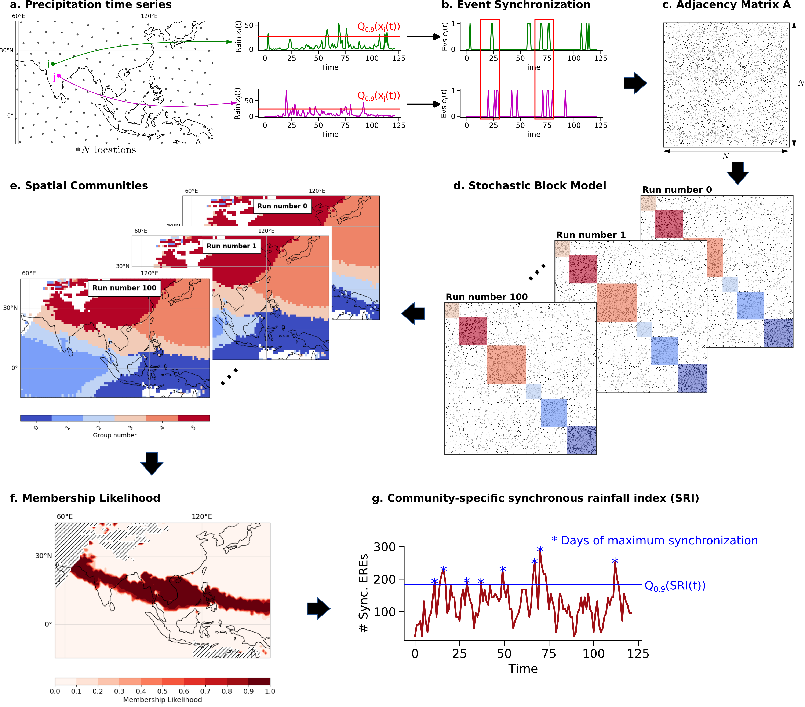
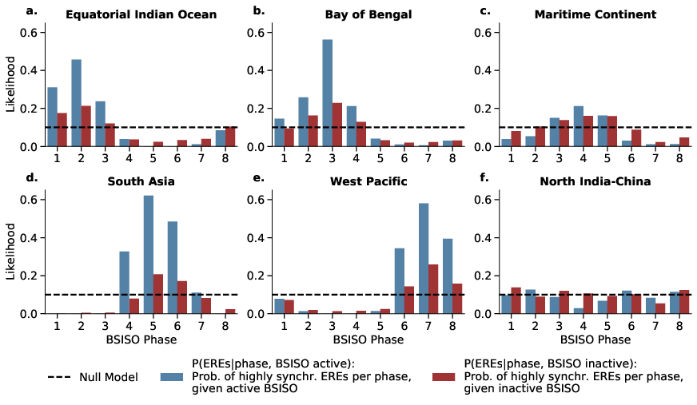
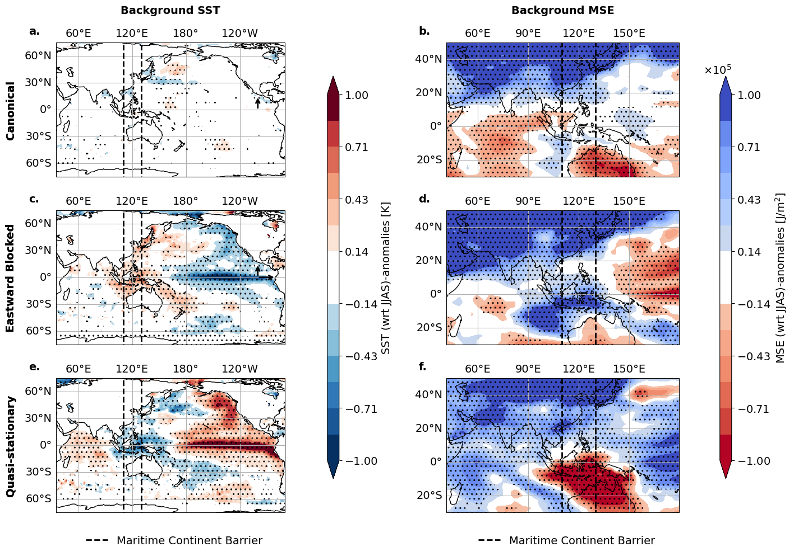
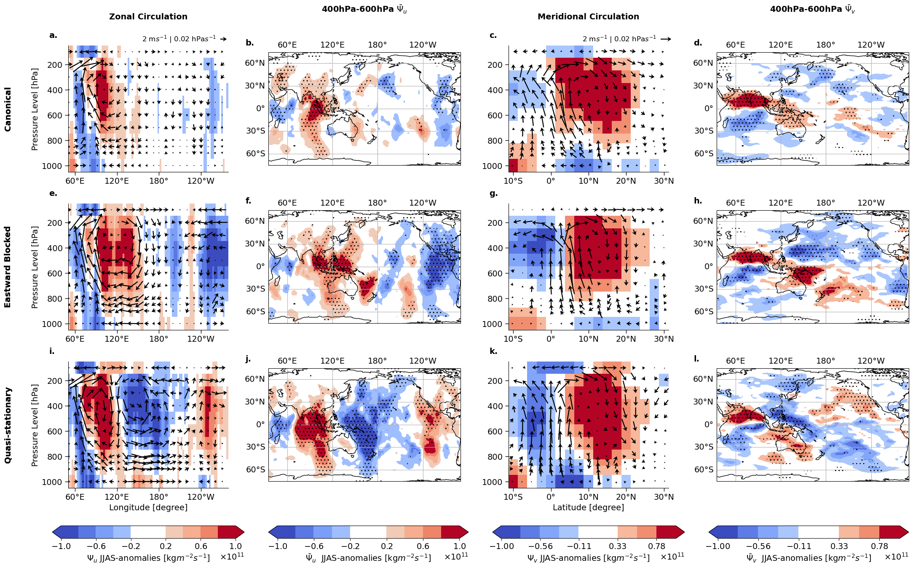
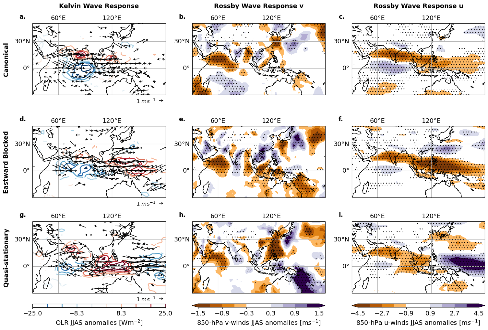
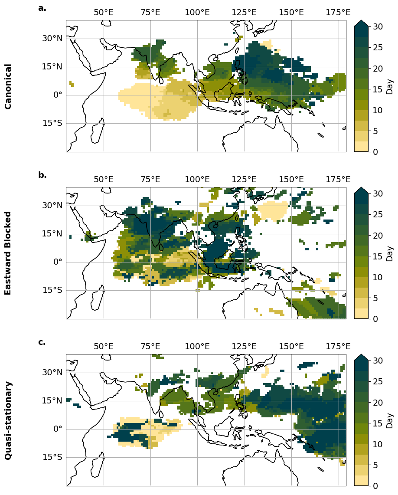

[](https://zenodo.org/badge/latestdoi/575759590)

# Extreme rainfall propagation within Boreal Summer Intraseasonal Oscillation modulated by Pacific sea surface temperature
We apply community detection on climate networks of Extreme Rainfall Events (EREs) to determine their intraseasonal variability.

An intuition on network community detection is given by:
***

***

## Clone the repo and install all required packages

### 1. Clone repository with submodules:
```
git clone --recurse-submodules git@github.com:fstrnad/netcommunities.git
```

### 2. Installing packages
To reproduce our analysis described in the paper follow these steps:
We recommend to create a new environment and install all required packages by running:
```
conda env create -f submodules/climnet/condaEnv.yml
conda activate climnetenv
pip install graphriccicurvature
pip install -e submodules/geoutils
pip install -e submodules/climnet
```

### 3. Download data
Download Precipitation data from [MSWEP](http://www.gloh2o.org/mswep/). Regrid the file to 1°x1° daily resolution (using e.g. the [geoutils](https://github.com/fstrnad/geoutils) package) and store the merged file in the data folder.

## Reproduce plots

1. Create the corresponding dataset and graph
```
python bin/create_ds.py
python bin/create_network.py
python bin/lb_net.py
python bin/cut_network.py
python bin/cd_gt.py
python bin/prob_cd.py
```
The networks and community files are created and are stored in 'outputs/'. They are used for the paper plots later.

2. Reproduce plots in the paper by running
```
python bin/paper_plots.py
python bin/paper_propagation.py
```


The figures should look somehow similiar to the following:

***


***


***


***


***


***


***

