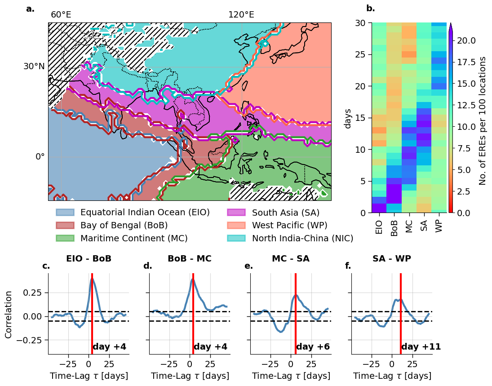
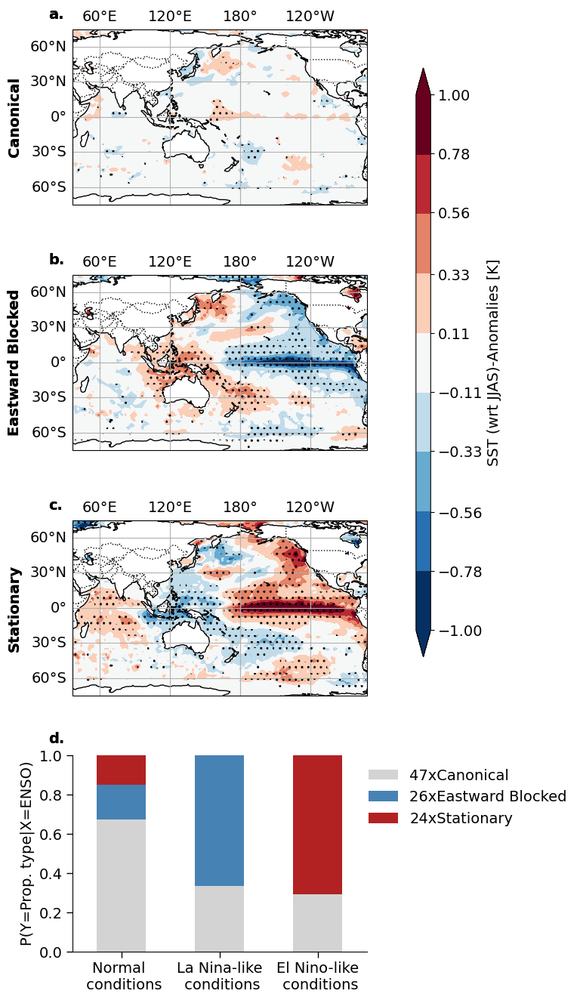

[](https://zenodo.org/badge/latestdoi/465245243)

# BSISO extreme rainfall propagation modulated by Pacific sea surface temperatures
We apply community detection on climate networks of Extreme Rainfall Events (EREs) to determine their intraseasonal variability.

An intuition on network community detection is given by:
***

***

## Clone the repo and install all required packages 

### 1. Clone repository with submodules:
```
git clone --recurse-submodules git@github.com:fstrnad/netcommunities.git
```

### 2. Installing packages
To reproduce our analysis described in the paper follow these steps:
We recommend to create a new environment and install all required packages by running: 
```
conda env create -f submodules/climnet/condaEnv.yml 
conda activate climnetenv 
pip install graphriccicurvature
pip install -e submodules/climnet/geoutils 
pip install -e submodules/climnet 
```

### 3. Download data
Download Precipitation data from [MSWEP](http://www.gloh2o.org/mswep/). Regrid the file to 1°x1° daily resolution (using e.g. the [geoutils](https://github.com/fstrnad/geoutils) package and store the merged file in the data folder.

## Reproduce plots

1. Create the corresponding dataset and graph
```
python bin/create_net.py 
python bin/cd_gt.py 
python bin/t2m_create_net.py -data 'datapath' -s 'Nino_CP'
```
The networks created and later used for these plots are stored in 'outputs/'.

2. Reproduce plots in the paper by running 
```
python bin/paperplots.py -d 'datapath' -ep 'epNetPath' -cp 'cpNetPath' -normal 'normalNetPath'
```


The figures should look somehow similiar to the following:

***


***


***



